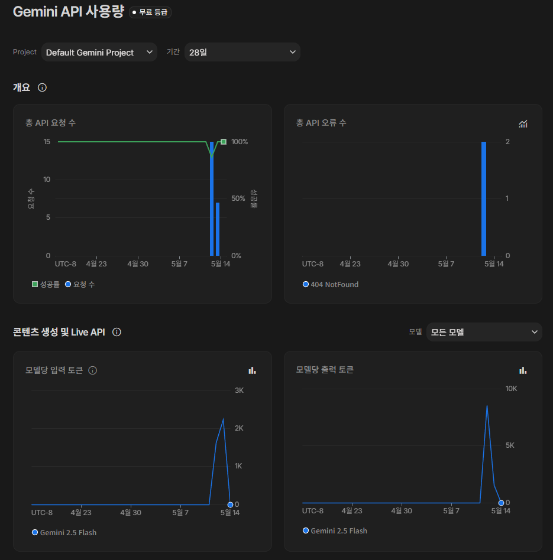

# 🎓 대학교 학사 관리 시스템 (with AI)

> **Java Spring MVC로 구축된 학생, 강좌, 수강 신청 관리 시스템에 실시간 DB 연동형 AI 어시스턴트를 결합한 지능형 웹 애플리케이션입니다.**

[](https://www.oracle.com/java/)
[](https://gradle.org/)
[](https://www.mysql.com/)
[](https://ai.google.dev/)

---

## 📸 프로젝트 미리보기

### 🏠 메인 대시보드

*대학교 관리 시스템 - 학생 및 강좌 관리를 위한 직관적이고 깔끔한 인터페이스*

---

## ✨ 핵심 기능

- ✨ **AI 어시스턴트 (Gemini 2.5 Flash)** - 실시간 DB(학생, 강좌, 수강 신청 데이터)를 직접 분석하여 학사 업무를 안내하는 지능형 조수
- 👥 **학생 관리** - 학생 정보 등록, 조회, 수정, 삭제(CRUD) 및 검색 기능
- 📚 **강좌 관리** - 개설 강좌 정보 관리 및 교수진/학점 상세 관리
- 📝 **수강 신청 시스템** - 실시간 수강 신청 처리 및 학생별 수강 목록 관리
- 🔍 **검색 및 페이징** - 대규모 데이터 처리를 위한 검색 기능 및 효율적인 페이징 지원
- 📱 **반응형 디자인** - 데스크탑과 모바일 기기 모두 최적화된 화면 제공

---

## 🛠 기술 스택

**Backend:**
- Java 17
- Spring MVC (Servlet-based)
- MyBatis (Persistence Framework)
- MySQL 8.0 (Database)
- HikariCP (Connection Pooling)
- **AI**: Gemini 2.5 Flash API (v1beta)
- **Networking**: OkHttp3 (API 통신)
- **JSON Processing**: Gson

**Frontend:**
- JSP & JSTL
- Bootstrap 5 (Responsive UI)
- jQuery

**Build & Deploy:**
- Gradle
- Apache Tomcat 9+

---

## 🚀 빠른 시작 가이드

```bash
# 저장소 클론
git clone https://github.com/prisma77/Crud.git
cd Crud

# 프로젝트 빌드 (WAR 파일 생성)
./gradlew war

# Tomcat에 배포
cp build/libs/crud.war $TOMCAT_HOME/webapps/
```

---

## ⚙️ 설치 및 설정

### 1. 데이터베이스 설정
아래 쿼리를 통해 데이터베이스와 사용자를 생성합니다.

```sql
CREATE DATABASE orange DEFAULT CHARACTER SET utf8mb4 COLLATE utf8mb4_unicode_ci;
CREATE USER 'prisma'@'localhost' IDENTIFIED BY '1234';
GRANT ALL PRIVILEGES ON orange.* TO 'prisma'@'localhost';
FLUSH PRIVILEGES;
```

스키마와 샘플 데이터를 실행합니다.
```bash
mysql -u prisma -p orange < schema.sql
mysql -u prisma -p orange < data.sql
```

### 2. AI API 키 설정 (필수)
`src/main/resources/config/api.properties` 파일을 생성하고 발급받은 Gemini API 키를 입력하세요.
```properties
gemini.api.key=사용자의_API_키
```
*(.gitignore에 등록)*

### 3. 접속 정보 확인
브라우저에서 아래 주소로 접속합니다.
```
http://localhost:8080/crud
```

---

## 📸 AI 어시스턴트 데모

| 1. 데이터 조회 (분석 중..) | 2. 분석 완료 (실시간 답변) |
| :---: | :---: |
|  |  |
| *사용자 질문 시 실시간 DB 데이터를 컨텍스트로 생성* | *데이터를 바탕으로 한 답변 생성* |

---

## 🗂 프로젝트 구조

```
src/
├── main/
│   ├── java/com/prisma77/crud/
│   │   ├── controller/              # 웹 컨트롤러 (Student, Course, Enrollment, AI)
│   │   ├── service/                 # 비즈니스 로직
│   │   ├── repository/              # 데이터 접근 계층 (MyBatis Mapper)
│   │   ├── domain/                  # 엔티티 클래스
│   │   └── config/                  # DB 및 인코딩 설정
│   ├── resources/
│   │   ├── config/                  # DB 및 API 설정 파일
│   │   └── logback.xml              # 로깅 설정
│   └── webapp/
│       ├── WEB-INF/
│       │   └── views/               # JSP 템플릿 (학생, 강좌, AI 채팅 등)
│       └── index.jsp                # 메인 페이지
```

---

## 📈 API 모니터링

*Google AI Studio를 통한 실시간 호출 및 성능 모니터링*

---

## 작성자
**prisma77**

최종 수정일: 2026/05/13
- GitHub: [@prisma77](https://github.com/prisma77)
